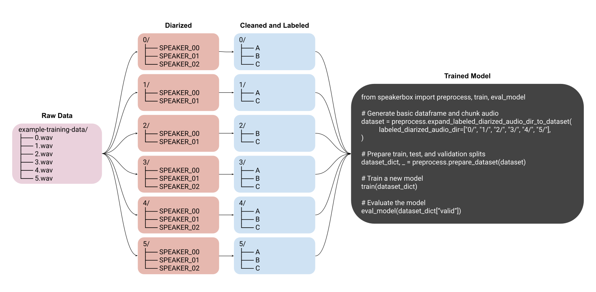

# Summary

Automated speaker identification is a modeling challenge for research when large-scale coporara, such as audio recordings or transcripts, are relied upon for evidence (e.g. Journalism, Qualitative Research, Law, etc.). To address current difficulties in training fine-tuned speaker identification models, we propose Speakerbox: a framework for few-shot fine-tuning of an audio transformer. Specifically, Speakerbox makes multi-recording, multi-speaker identification model training as simple as possible while still training an accurate, useful model for application. Speakerbox works by ensuring data are safely stratified by speaker id and held-out by recording id prior to fine-tuning of a pretrained Wav2Vec2 Transformer on a small number of audio examples. We show that with less than an hour of audio-recorded input, Speakerbox can fine-tune a multi-speaker identification model for use in assisting researchers in audio and transcript annotation.

# Statement of Need

Speaker-annotated transcripts from audio recordings are an increasingly important applied research problem in natural language processing. For example, speaker-annotated audio and transcript data has previously been used to create comprehensive analyses of conversation dynamics [@jacobi_justice_2017;@morris_reexamining_2001;@osborn_speaking_2010;@miller_effect_2022;@maltzman_politics_1996;@slapin_sound_2020]. However, multi-speaker audio classification models (for the purpose of speaker identification) can be cumbersome and expensive to train and unwieldy to apply. Speaker diarization is , "the unsupervised identification of each speaker within an audio stream and the intervals during which each speaker is active" [@SpeakerDia2012]. Diarization is a useful method in certain applications of large-scale automated analysis, and while there are free and open tools available to perform these tasks (e.g. )[@Bredin2020;@Bredin2021]), existing approaches rely upon unsupervised methods. While fast and efficient, an unsupervised approach to speaker diarization often inconsistently labels speakers across different recordings and does not adequately meet accuracy thresholds required for research purposes [cite].

Speakerbox is built with the goal of making multi-recording, multi-speaker identification model training as simple as possible while still attempting to help train an accurate, useful model for application (e.g. a set of recordings where each recording has some subset of a set of speakers).

To this end Speakerbox provides functionality to:

1. Create or import annotation sets;
2. Prepare an audio dataset into stratified and held-out, train, test, and validation subsets;
3. Train and evaluate a fine-tuned speaker identification model; and,
4. Apply a speaker identification model to an audio file.

# Related Work

While there is continuous research in new methods and model architectures for few-shot speaker identification models [@Wolters2020ASO;@li2022-few-shot;@kumar2020-few-shot], there exists little work in creating an open-source, easy-to-use library for their training and evaluation.

For more general speech processing and filtering, [SpeechPy](https://github.com/astorfi/speechpy) is an open-source solution for "speech processing and feature extraction ... [by providing the] most frequent used speech features including MFCCs and filterbank energies" [@Torfi2018].

Open-source libraries more closely related to diarization and speaker identification include [Pyannote.Audio](https://github.com/pyannote/pyannote-audio) and [Transformers](https://github.com/huggingface/transformers). [Pyannote.Audio](https://github.com/pyannote/pyannote-audio) "provides a set of trainable end-to-end neural building blocks that can be combined and jointly optimized to build speaker diarization pipelines" [@Bredin2020;Bredin2021]. While [Transformers](https://github.com/huggingface/transformers) is a library which "provides thousands of pretrained models to perform tasks on different modalities such as text, vision, and audio" [@wolf-etal-2020-transformers]. Speakerbox makes use of both `pyannote.audio` and `transformers`.

[add sentence on how or why this is related to speakerbox]

There are also paid solutions for quickly annotating and training a custom speaker diarization and audio classification model such as [ExplosionAI's Prodigy Platform](https://prodi.gy/features/audio-video).

Finally, [SetFit](https://github.com/huggingface/setfit) ("an efficient and prompt-free framework for few-shot fine-tuning of Sentence Transformers") provides similar functionality as Speakerbox but for text-based data [@setfit].

Speakerbox brings many of these tools together in order to be a solution for speaker identification as an easy-to-use and open-source library for the annotation of audio data and the fine-tuning of a speaker identification model. [

# Functionality

Speakerbox attempts to simplify transformer fine-tuning by making the following processes easier:

* Creation of a dataset via diarization;
* Import of a dataset from existing annotation platforms;
* Preparation of train, test, and validation subsets protected from speaker and recording data leakage;
* Fine-tuning and evaluation of a transformer; and,
* Application of a trained model across an audio file



The goal of this library is to simplify these proceses while maintaining fidelity in the training and utility of a speaker identification model for application.

## Dataset Generation and Import

### Diarization

Diarization is the unsupervised process of splitting audio into segments grouped by speaker identity. The output of a diarization model is usually a random ID (e.g. "speaker_0", "speaker_1", etc.) where there is no guarantee that "speaker_0" from a first audio file, is the same "speaker_0" from a second audio file. Because of this unsupervised nature, diarization cannot be used as a single solution for multi-speaker, multi-recording speaker identification. It can however be used for quickly generating large amounts of training examples which can be validated and labeled for use in a later speaker identification training set.

We make use of diarization as one method for preparing a speaker identification training set by using a model provided by `pyannote.audio` to diarize an audio file and place the unlabeled portions of audio into directories on the user's file system. A user can then listen to a few or all of the samples of audio in each directory, remove any samples that were mis-classified, and finally rename each of the directories with a true and consistent speaker identifier (e.g. a name, database ID, etc.).

### Using Gecko Annotations

If a fully supervised method for dataset generation is preferred, or to improve model accuracy and improve coverage of edge cases, users of Speakerbox may use [Gecko](https://github.com/gong-io/gecko): a free web application for manual segmentation of audio files by speaker as well as annotation of the linguistic content of a conversation [@Gecko2019]. Speakerbox can make use of Gecko annotations as a method for training set creation by providing functions to split and prepare audio files using the annotations stored in a Gecko created JSON file.

## Preparation for Model Training and Evaluation

To ensure that a Speakerbox model is learning the features of each speaker's voice (and not the features of the microphone or the specific words and phrases of each recording) we create dataset training, test, and evaluation splits [*is split the write noun here? in the next sentence we say "subset" - best to stay consistent] based off of a recording holdout and speaker stratification pattern. Each train, test, and evaluation subset must contain unique recording IDs to reduce the chance of learning the features of specific microphones or recording contexts, and each produced subset must contain recordings of every speaker available from the whole dataset. For example, if there are nine unique speakers in the complete dataset, then each train, test, and evaluation subset is required to have examples of all nine speakers.

If the speaker stratification condition is not met, Speakerbox attempts to retrain a diarization model using a simple random sampling process. If the sampling function cannot find a valid recording holdout and speaker stratification configuration given the sampling iterations, we inform the user of this failure and prompt them to add more examples to the dataset.

## Model Fine-Tuning

The Speakerbox training process consists of fine-tuning a pre-trained Wav2Vec2 speaker identification model [@yang2021superb] provided by Huggingface's Transformers library [@wolf-etal-2020-transformers]. The default model for fine-tuning ([superb/wav2vec2-base-superb-sid](https://huggingface.co/superb/wav2vec2-base-superb-sid)) was pre-trained on the VoxCeleb1 dataset [@Nagrani17].

As Speakerbox is a framework for fine-tuning the Wav2Vec2-base-superb-sid transformer, we will not cover the original evaluation of the model but instead provide details about what we believe is a more typical use case for a fine-tuned speaker identification model.

Our example dataset contains 9 unique speakers across 10 unique recordings and each recording has some or all of the 9 unique speakers for a total of 1 hour of audio. For our use-case in computational social science, this dataset represents a typical audio (and transcript) dataset created from government meetings, 1-on-1 interviews, group interviews, etc.

We further created random samples of this dataset with 15 minutes and 30 minutes audio (each then split between the train, test, and evaluation subsets). The results reported in Table 1 are the mean accuracy, precision, and recall of five iterations of model training and evaluation using the differently sized datasets as inputs to our `train` and `eval_model` functions.

| dataset_size   | mean_accuracy   | mean_precision   | mean_recall   | mean_training_duration_seconds   |
|:---------------|----------------:|-----------------:|--------------:|---------------------------------:|
| 15-minutes     | 0.874 ± 0.029   | 0.881 ± 0.037    | 0.874 ± 0.029 | 101 ± 1                          |
| 30-minutes     | 0.929 ± 0.006   | 0.94 ± 0.007     | 0.929 ± 0.006 | 186 ± 3                          |
| 60-minutes     | 0.937 ± 0.02    | 0.94 ± 0.017     | 0.937 ± 0.02  | 453 ± 7                          |

All results reported are the average of five model training and evaluation trials for each of the different dataset sizes. All models were fine-tuned using an NVIDIA GTX 1070 TI.

We provide a method to reproduce these models as follows:

```python
from speakerbox.examples import train_and_eval_all_example_models

# Returns a pandas DataFrame
results = train_and_eval_all_example_models()
```

# Usage in Existing Research

We are utilizing Speakerbox trained models to annotate municipal council meeting transcripts provided by the Council Data Project [@Brown2021]. In our initial research, we first annotated ~10 hours of audio using the Gecko platform in ~12 hours of time, we then used our diarization and labeling method to annotate an additional ~21 hours of audio in ~6 hours of time. In total, the dataset was annotated and compiled in less than ~18 hours and contained ~31 hours of audio from meetings of the Seattle City Council [cite previous JOSS paper as infra for data source]. The model trained from the annotated dataset with the best precision and recall achieved 0.977 and 0.976 respectively. We additionally have used this model to annotate ~200 audio-aligned transcripts of Seattle City Council meetings and are now conducting analysis of speaker behaviors and group dynamics in such meetings.

# Future Work
The few-shot approach we have described in Speakerbox could be extended, and made more accessible in future work. This could include:
1. **The creation of a GUI for the application and workflow process.** GUIs developed from pure Python have become much more accessible in recent years and a GUI would likely help non-computational scientists more easily access advanced training models like Speakerbox.
2. **Productionization**  [Say this more generally and then specifically - how could SB be integrated in ANY text processing pipeline, and then particular how we plan to do this in CDP] We hope to additionally use Speakerbox produced models in a more "production" sense by directly integrating their use into the Council Data Project processing workflow so that transcripts are labelled immediately after they are produced. In doing so, we hope to create a template GitHub repository to generate a new repository for the user for storing annotation and audio files for which to use for automatically training a model using Continuous Integration systems.

# Acknowledgements

We wish to thank the University of Washington Information School for support, and a grant from New America Ventures for the Puget Sound Public Interest Technology Clinic. We wish to thank all the past and present contributors of the Council Data Project.

# References
